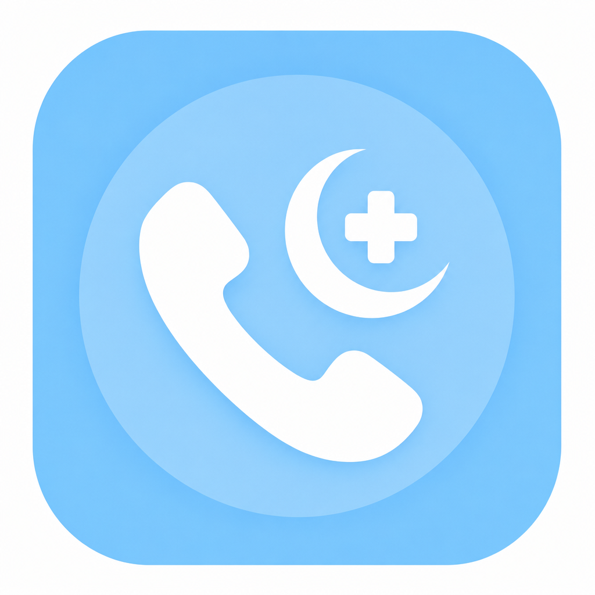
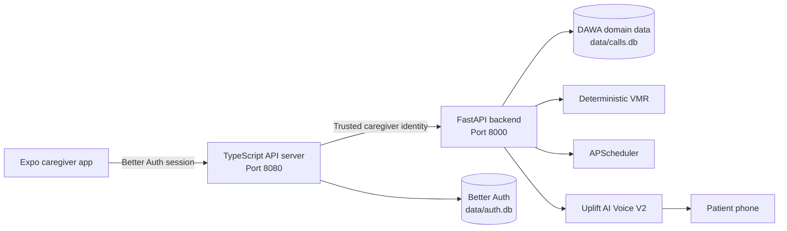

<div align="center">
  

  # DAWA

  **Medication reminders that reach patients through a familiar voice and a normal phone call.**

  Urdu first. Caregiver managed. Built for patients who should not need to read an app to stay cared for.

  [](https://expo.dev/)
  [](https://reactnative.dev/)
  [](https://fastapi.tiangolo.com/)
  [](https://www.python.org/)
  [](https://www.typescriptlang.org/)

  [Why DAWA](#why-dawa) · [Experience](#the-experience) · [Architecture](#architecture) · [Run locally](#run-locally) · [Safety](#safety-is-the-product)
</div>

---

> Every prescription assumes you can read. DAWA does not.

DAWA is a bilingual caregiver platform for elderly and low literacy patients in Pakistan. A caregiver manages medicine schedules in an English or Urdu mobile app. When it is time for a dose, DAWA calls the patient's ordinary phone and speaks in short, safe Urdu turns.

The patient does not need a smartphone, an account, mobile data, or the ability to navigate an interface.

## Why DAWA

Most medication apps are designed around the person taking the medicine. That sounds reasonable until the patient cannot read the label, use a smartphone, or confidently distinguish one tablet from another.

DAWA separates the experience into two sides:

| Caregiver | Patient |
| --- | --- |
| Uses the bilingual Expo app | Receives a normal phone call |
| Manages medicines and schedules | Hears a short Urdu reminder |
| Adds visual recognition cues | Identifies medicine using familiar cues |
| Reviews calls and confirmed outcomes | Responds by speaking naturally |

No new patient workflow to learn. No medical facts invented. No adherence guessed from whether a call connected.

## The Experience

```text
1. Caregiver signs in
2. Patient phone is verified once
3. Medicines, schedules and recognition cues are added
4. DAWA calls at the scheduled time
5. The conversation stays inside verified medicine facts
6. Caregiver sees call status and adherence as separate outcomes
```

### Built for real caregiving

- Bilingual English and Urdu caregiver interface with right to left layouts.
- One time patient phone verification by voice call.
- Automatic scheduled reminders and an explicit call now action.
- Visual medicine cues such as package colour, stripe, shape and storage location.
- Caregiver selected reminder voice with authenticated audio previews.
- Clear call history that never equates call completion with medicine adherence.
- Owner scoped patient data protected by Better Auth and Google OAuth.

## Safety Is the Product

DAWA is a reminder and support system. It does not prescribe, diagnose, change a dose, recommend an extra dose, or replace a clinician.

| Invariant | What it means |
| --- | --- |
| **Completed is not taken** | A completed call never becomes adherence unless the patient explicitly confirms it. |
| **Closed world facts** | Voice V2 can use only verified medicine, schedule and recognition data. |
| **Deterministic VMR** | Medicine resolution uses deterministic rules, not embeddings or an LLM identity decision. |
| **No duplicate dose advice** | If a patient is unsure whether a dose was already taken, DAWA does not recommend another. |
| **Fail closed access** | Caregiver endpoints reject missing or invalid authentication. |
| **Trusted identity boundary** | FastAPI accepts caregiver identity only from the authenticated TypeScript gateway. |

## Architecture



### Request boundary

```text
Expo app
  -> TypeScript API server validates Better Auth
  -> gateway injects trusted caregiver identity
  -> FastAPI applies owner scoped domain rules
  -> SQLite stores local domain state
```

The mobile app never receives Uplift credentials, Google secrets, Better Auth secrets, internal API secrets, or an unmasked patient phone number.

## Stack

| Layer | Technology |
| --- | --- |
| Caregiver app | Expo 54, React Native, Expo Router, TypeScript |
| Authentication | Better Auth, Google OAuth, authenticated native cookie bridge |
| API gateway | Express 5, TypeScript, Pino |
| Domain backend | FastAPI, Pydantic, APScheduler, HTTPX |
| Voice | Uplift AI Voice V2, Urdu conversation flow |
| Storage | SQLite with separate auth and domain databases |
| Tooling | pnpm, uv, pytest, Vitest |

## Repository

```text
backend/                 FastAPI domain backend and safety tests
artifacts/api-server/    Authenticated TypeScript gateway and Better Auth
artifacts/caregiver-app/ Bilingual Expo caregiver application
lib/                     Shared TypeScript libraries
scripts/local/           Local development launch scripts
data/                    Runtime SQLite state, ignored by Git
```

## Quick Start

### Prerequisites

- Node.js 22
- pnpm 10
- Python 3.13
- uv
- Expo Go for physical device testing
- cloudflared for public phone and OAuth testing

### Install

```bash
git clone <your-repository-url>
cd Dawa

uv sync --locked --python 3.13
pnpm install --frozen-lockfile
```

Python dependencies are defined by `pyproject.toml` and `uv.lock`. `backend/requirements.txt` is not the authoritative install path.

### Configure

Create server configuration from the example without committing secrets:

```bash
cp .env.example .env.local
```

Create the Expo public configuration:

```bash
mkdir -p artifacts/caregiver-app
printf 'EXPO_PUBLIC_API_BASE_URL=http://localhost:8080\n' > artifacts/caregiver-app/.env.local
```

Only public Expo values belong in `artifacts/caregiver-app/.env.local`.

## Run Locally

Open one terminal for each service.

**FastAPI**

```bash
scripts/local/backend.sh
```

**TypeScript API server**

```bash
scripts/local/api-server.sh
```

**Expo caregiver app**

```bash
scripts/local/expo.sh
```

Local service map:

| Service | Address |
| --- | --- |
| FastAPI | `http://localhost:8000` |
| TypeScript API server | `http://localhost:8080` |
| Expo Metro | Shown by Expo CLI |

### Physical phone and Google OAuth

Expose only the TypeScript gateway:

```bash
cloudflared tunnel --url http://localhost:8080
```

Use the resulting HTTPS origin for:

```text
.env.local
  BETTER_AUTH_URL=https://YOUR_PUBLIC_ORIGIN

artifacts/caregiver-app/.env.local
  EXPO_PUBLIC_API_BASE_URL=https://YOUR_PUBLIC_ORIGIN

Google OAuth redirect URI
  https://YOUR_PUBLIC_ORIGIN/api/auth/callback/google
```

Restart the API server and Expo after changing the public origin.

<details>
<summary><strong>Create the Uplift Voice V2 assistant</strong></summary>

Configure `UPLIFTAI_API_KEY`, then run:

```bash
set -a
source .env.local
set +a

cd backend
uv run --project .. python scripts/create_uplift_assistant.py
```

This command creates and verifies the assistant configuration. It does not place a phone call. Add the returned identifier to `.env.local` as `UPLIFT_ASSISTANT_ID`, then restart FastAPI.

</details>

<details>
<summary><strong>Health checks</strong></summary>

```bash
curl http://localhost:8000/health
curl http://localhost:8080/api/auth/ok
curl -i http://localhost:8080/api/dawa/patient
```

Expected behavior:

```text
FastAPI health                200 OK
API auth health               200 OK
Unauthenticated patient data  401 Unauthorized
```

If caregiver data returns `200` without a session, stop and fix authentication before continuing.

</details>

## Tests

```bash
# FastAPI
cd backend
uv run --project .. python -m pytest -q

# API server
cd ..
pnpm --filter @workspace/api-server run test

# TypeScript
pnpm run typecheck:libs
pnpm --filter @workspace/api-server run typecheck
pnpm --filter @workspace/caregiver-app run typecheck
```

Automated tests must never place a Uplift phone call, mutate the real assistant, perform Google OAuth, or contact a real phone number.

## Runtime Data

| Database | Purpose |
| --- | --- |
| `data/calls.db` | Patients, medicines, dose events, escalations and patient memory |
| `data/auth.db` | Better Auth users, sessions and OAuth accounts |

Runtime databases and environment files must not be committed.

## Demo Guardrail

A real DAWA call requires explicit operator authorization:

```text
AUTHORIZE REAL TEST CALL
```

Without that authorization, keep validation to health checks, authenticated UI flows and mocked test suites.

## Project Status

The local migration from Replit is complete for the core DAWA stack. The caregiver app, TypeScript gateway and FastAPI backend run as separate local services, with Cloudflare available only at the public edge for physical phone and OAuth testing.

Current validated areas include:

- Deterministic voice medication resolution.
- Proactive scheduled calls with duplicate dispatch protection.
- Authenticated and owner scoped caregiver APIs.
- One time patient phone verification.
- Persistent bilingual caregiver UI.
- Voice selection and authenticated preview playback.
- Separate call and adherence outcomes.

---

<div align="center">
  <strong>DAWA</strong><br/>
  Built for the patient polished health technology usually leaves behind.
</div>
