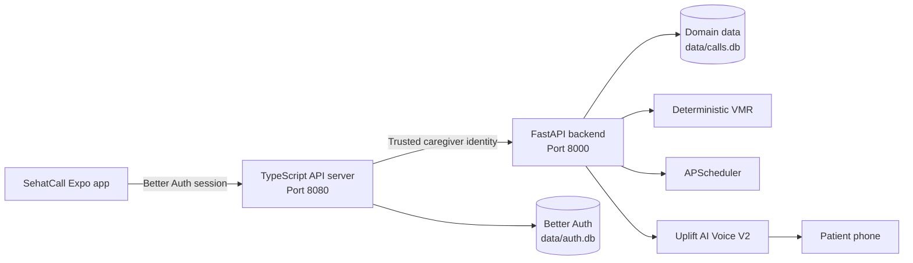

<div align="center">
  

  # SehatCall

  **Care, carried by a familiar voice.**

  A bilingual mobile caregiving app that turns medication schedules into clear Urdu phone calls for the people who need them.

  [](https://expo.dev/)
  [](https://reactnative.dev/)
  [](https://fastapi.tiangolo.com/)
  [](https://www.typescriptlang.org/)

  [Product](#care-from-an-app-reassurance-through-a-call) · [Experience](#the-mobile-experience) · [Safety](#safety-is-the-product) · [Architecture](#architecture) · [Run locally](#run-locally)
</div>

---

> Medication support should not depend on reading a label, owning a smartphone, or learning another interface.

## Care From an App. Reassurance Through a Call.

SehatCall is designed for a simple but often overlooked reality: the caregiver may use an app, while the patient may be better served by a phone call.

From one calm, bilingual mobile experience, a caregiver can verify a patient once, organise medicines, set reminder schedules, add familiar recognition cues, choose a voice, and review what happened. At dose time, SehatCall calls the patient's ordinary phone and speaks in short, careful Urdu turns.

The patient needs no account, no mobile data, no app, and no new digital habit.

| For the caregiver | For the patient |
| --- | --- |
| A focused English and Urdu mobile workspace | A familiar call on an ordinary phone |
| Medicine schedules and recognition details | Clear, concise Urdu conversation |
| One time phone verification | No login, reading, or navigation |
| Call history and explicit adherence outcomes | A voice that stays within verified facts |

## The Mobile Experience

SehatCall treats the caregiver app as the centre of the product, not a remote control for a demo.

- **Bilingual by design.** English and Urdu are first class experiences, including right to left layouts and persistent language choice.
- **Fast daily decisions.** The home view prioritises the next call, active schedules, patient status, and recent outcomes.
- **One time onboarding.** Once a patient's number is verified, returning caregivers move directly into the working app.
- **Recognisable medicine details.** Caregivers can record package colour, stripe, shape, and storage location to support safer identification.
- **A voice with context.** Authenticated previews make voice selection deliberate before a reminder is sent.
- **Honest outcomes.** Call completion and medicine adherence remain separate, visible facts.

```text
Sign in
   -> verify the patient once
   -> add medicine and recognition cues
   -> choose a schedule and voice
   -> SehatCall places the reminder call
   -> review the call and explicit patient response
```

## Why It Matters

Most medication products assume the person taking the medicine can read, navigate a smartphone, and confidently identify a tablet. SehatCall shifts the complex work to the caregiver while meeting the patient through a technology they already understand: a call.

That makes the product useful beyond reminders. It creates a bridge between digital caregiving and everyday accessibility without pretending that a completed phone call is proof of adherence.

## Safety Is the Product

SehatCall is a reminder and support system. It does not diagnose, prescribe, alter a dose, recommend an extra dose, or replace a clinician.

| Invariant | Product behaviour |
| --- | --- |
| **Completed is not taken** | A completed call never becomes adherence unless the patient explicitly confirms it. |
| **Closed world facts** | Voice V2 may use only verified medicine, schedule, and recognition data. |
| **Deterministic VMR** | Medicine resolution follows deterministic rules, not an LLM identity guess. |
| **No duplicate dose advice** | If the patient is unsure whether a dose was taken, SehatCall never recommends another. |
| **Fail closed access** | Caregiver endpoints reject missing or invalid authentication. |
| **Private ownership** | Every patient record remains scoped to its authenticated caregiver. |

## Architecture



```text
Mobile app
  -> TypeScript gateway validates Better Auth
  -> gateway injects trusted caregiver identity
  -> FastAPI applies owner scoped domain rules
  -> SQLite stores local auth and domain state separately
```

The mobile app never receives Uplift credentials, Google secrets, Better Auth secrets, internal API secrets, or an unmasked patient phone number.

## Technology

| Layer | Technology |
| --- | --- |
| Mobile app | Expo 54, React Native, Expo Router, TypeScript |
| Languages | English and Urdu with right to left support |
| Authentication | Better Auth, Google OAuth, native cookie bridge |
| API gateway | Express 5, TypeScript, Pino |
| Domain backend | FastAPI, Pydantic, APScheduler, HTTPX |
| Voice | Uplift AI Voice V2 with an Urdu conversation flow |
| Storage | SQLite with separate auth and domain databases |
| Tooling | pnpm, uv, pytest, Vitest |

## Repository

```text
backend/                 FastAPI domain backend and safety tests
artifacts/api-server/    Authenticated TypeScript gateway and Better Auth
artifacts/caregiver-app/ Bilingual SehatCall mobile application
assets/brand/            Product artwork used by this README
lib/                     Shared TypeScript libraries
scripts/local/           Local development launch scripts
data/                    Runtime SQLite state, ignored by Git
```

## Quick Start

### Prerequisites

- Node.js 22
- pnpm 10
- Python 3.13
- uv
- Expo Go for physical device testing
- cloudflared for public phone and OAuth testing

### Install

```bash
git clone <your-repository-url>
cd Dawa

uv sync --locked --python 3.13
pnpm install --frozen-lockfile
```

Python dependencies are defined by `pyproject.toml` and `uv.lock`. `backend/requirements.txt` is not the authoritative install path.

### Configure

Create server configuration from the example without committing secrets:

```bash
cp .env.example .env.local
```

Create the Expo public configuration:

```bash
printf 'EXPO_PUBLIC_API_BASE_URL=http://localhost:8080\n' > artifacts/caregiver-app/.env.local
```

Only public `EXPO_PUBLIC_*` values belong in the Expo environment file.

## Run Locally

Open one terminal for each service.

```bash
# Terminal 1: FastAPI on port 8000
scripts/local/backend.sh

# Terminal 2: TypeScript API and Better Auth on port 8080
scripts/local/api-server.sh

# Terminal 3: Expo
scripts/local/expo.sh
```

| Service | Local address |
| --- | --- |
| FastAPI | `http://localhost:8000` |
| TypeScript API server | `http://localhost:8080` |
| Expo Metro | Displayed by the Expo CLI |

### Physical Phone and Google OAuth

Expose only the TypeScript gateway:

```bash
cloudflared tunnel --url http://localhost:8080
```

Use the resulting HTTPS origin in the server configuration, Expo public configuration, and Google OAuth callback:

```text
BETTER_AUTH_URL=https://YOUR_PUBLIC_ORIGIN
EXPO_PUBLIC_API_BASE_URL=https://YOUR_PUBLIC_ORIGIN
https://YOUR_PUBLIC_ORIGIN/api/auth/callback/google
```

Restart the API server and Expo after changing the public origin.

<details>
<summary><strong>Create a SehatCall Voice V2 assistant</strong></summary>

Configure `UPLIFTAI_API_KEY`, then run:

```bash
set -a
source .env.local
set +a

cd backend
uv run --project .. python scripts/create_uplift_assistant.py
```

This command creates and verifies the assistant configuration. It does not place a phone call. Add the returned identifier to `.env.local` as `UPLIFT_ASSISTANT_ID`, then restart FastAPI.

</details>

<details>
<summary><strong>Health checks</strong></summary>

```bash
curl http://localhost:8000/health
curl http://localhost:8080/api/auth/ok
curl -i http://localhost:8080/api/dawa/patient
```

The `/api/dawa` namespace is intentionally retained as a stable internal API contract during the SehatCall product rebrand.

```text
FastAPI health                200 OK
API auth health               200 OK
Unauthenticated patient data  401 Unauthorized
```

If caregiver data returns `200` without a session, stop and fix authentication before continuing.

</details>

## Tests

```bash
# FastAPI
cd backend
uv run --project .. python -m pytest -q

# Return to the repository root
cd ..
pnpm --filter @workspace/api-server run test
pnpm run typecheck:libs
pnpm --filter @workspace/api-server run typecheck
pnpm --filter @workspace/caregiver-app run typecheck
```

Automated tests must never place a Uplift phone call, mutate a real assistant, perform Google OAuth, or contact a real phone number.

## Runtime Data

| Database | Purpose |
| --- | --- |
| `data/calls.db` | Patients, medicines, dose events, escalations, and patient memory |
| `data/auth.db` | Better Auth users, sessions, and OAuth accounts |

Runtime databases and environment files are ignored and must never be committed.

## Real Call Guardrail

A real SehatCall phone call requires explicit operator authorization:

```text
AUTHORIZE REAL TEST CALL
```

Without that authorization, validation stays limited to health checks, authenticated UI flows, and mocked test suites.

---

<div align="center">
  <strong>SehatCall</strong><br/>
  Thoughtful mobile caregiving for patients polished health technology too often leaves behind.
</div>
