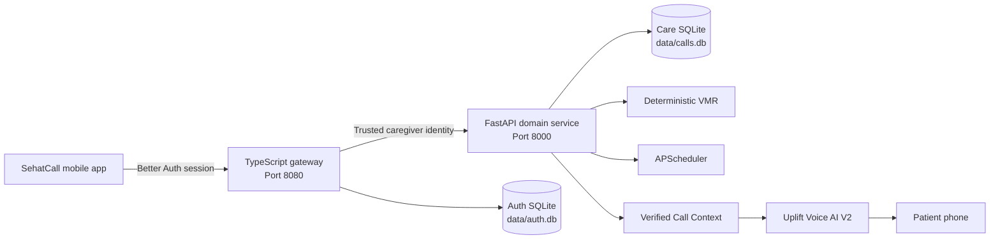

<div align="center">
  
  <h1 align="center"><strong>SEHATCALL</strong></h1>
  <p align="center"><strong>VOICE AI FOR MEDICATION CARE</strong></p>
  <p align="center">Caregiver managed. Urdu first. Delivered as a phone call.</p>

  [](#voice-ai-grounded-in-verified-care)
  [](https://expo.dev/)
  [](https://fastapi.tiangolo.com/)
  [](#the-mobile-experience)

  **[The idea](#the-caregiver-gets-an-app-the-patient-gets-a-call)** &nbsp; | &nbsp;
  **[Voice AI](#voice-ai-grounded-in-verified-care)** &nbsp; | &nbsp;
  **[Safety](#intelligence-with-boundaries)** &nbsp; | &nbsp;
  **[Architecture](#architecture)** &nbsp; | &nbsp;
  **[Run locally](#run-locally)**
</div>

---

## The Caregiver Gets an App. The Patient Gets a Call.

**SehatCall is a bilingual mobile caregiving platform that transforms medication schedules into thoughtful, real-time Urdu voice conversations.**

A caregiver handles the digital work from a focused Expo app: verifying the patient, organising medicines, defining schedules, recording visual recognition cues, selecting a voice, and reviewing outcomes. When a dose is due, SehatCall reaches the patient through the most familiar interface possible: their phone ringing.

The patient does not need a smartphone. They do not need mobile data, an account, or the ability to read a medicine label. They answer a normal call and speak naturally.

> This is not an alarm with a voice attached. It is an AI medication companion built around verified care, accessible conversation, and clear clinical boundaries.

## One Product. Two Experiences.

| Caregiver experience | Patient experience |
| --- | --- |
| Bilingual English and Urdu mobile app | A familiar call on an ordinary phone |
| Medicine schedules and recognition cues | Short, natural Urdu conversation |
| One-time phone ownership verification | No login, app, reading, or navigation |
| Voice selection with authenticated previews | A consistent, caregiver-selected voice |
| Call history and explicit adherence outcomes | Answers grounded only in verified facts |

## Voice AI, Grounded in Verified Care

SehatCall combines real-time speech technology with a deliberately constrained intelligence layer. The goal is not to make an AI sound medically impressive. The goal is to make every answer useful, human, and safe.

### The voice pipeline

```text
Patient speaks in Urdu
        |
        v
Groq Whisper speech recognition
        |
        v
Safety-constrained conversational model
        |
        v
Uplift AI Urdu voice synthesis
        |
        v
Patient hears one short, contextual response
```

### What makes the intelligence different

| Capability | SehatCall approach |
| --- | --- |
| **Real-time Urdu Voice AI** | Understands spoken Urdu and replies in brief, natural turns over a normal phone call. |
| **Verified Call Context** | Every call receives a compact set of caregiver-confirmed medicine, schedule, cue, and doctor facts. |
| **Deterministic VMR** | Medication identity is resolved through deterministic rules rather than an LLM guess. |
| **Closed-world reasoning** | If a fact is absent from the verified context, the assistant says it does not know and refers back to the caregiver. |
| **Conversation continuity** | The assistant follows the patient's current question without restarting the reminder or repeating itself. |
| **Voice choice** | Caregivers can preview and select the Urdu voice their patient will hear. |

## The Mobile Experience

The SehatCall app is the operational centre of care, not a thin controller for an AI demo.

**Onboard once**

Sign in with Google, add the patient, verify their phone through a spoken code, and move directly into the working app on every return.

**Describe medicine the way people recognise it**

Store the nickname, package colour, stripe, tablet shape, storage location, routine anchor, schedule, dose, and verified doctor instructions.

**Know what happens next**

The home experience surfaces the next call, active medicines, verification state, and recent outcomes without burying daily decisions in settings.

**Hear the experience before the patient does**

Authenticated voice previews let the caregiver choose a suitable reminder voice before a call is placed.

```text
SIGN IN
   -> VERIFY ONCE
   -> ADD MEDICINE CONTEXT
   -> CHOOSE SCHEDULE AND VOICE
   -> SEHATCALL PLACES THE CALL
   -> REVIEW CALL AND ADHERENCE SEPARATELY
```

## Intelligence With Boundaries

The safest AI is not the one that answers everything. It is the one that knows exactly where its authority ends.

| Invariant | Guaranteed behaviour |
| --- | --- |
| **Completed is not taken** | A completed call never becomes adherence unless the patient explicitly confirms it. |
| **No invented medicine facts** | The voice assistant cannot improvise dosage, appearance, purpose, side effects, or instructions. |
| **No duplicate-dose advice** | If the patient is unsure whether a dose was taken, SehatCall never recommends another. |
| **No clinical overreach** | SehatCall does not diagnose, prescribe, alter doses, or replace a clinician. |
| **Fail-closed authentication** | Caregiver data routes reject missing or invalid sessions. |
| **Private ownership** | Every patient and medicine record is scoped to the authenticated caregiver. |

## Architecture



The mobile app never receives Uplift credentials, Google secrets, Better Auth secrets, internal API secrets, or an unmasked patient phone number.

## Technology

| Layer | Technology |
| --- | --- |
| Mobile product | Expo 54, React Native, Expo Router, TypeScript |
| Language experience | English and Urdu with right-to-left support |
| Authentication | Better Auth, Google OAuth, native cookie bridge |
| API gateway | Express 5, TypeScript, Pino |
| Domain backend | FastAPI, Pydantic, APScheduler, HTTPX |
| Voice intelligence | Groq Whisper STT, safety-constrained LLM, Uplift AI TTS |
| Medication resolution | Deterministic Verified Medication Resolution |
| Persistence | SQLite with isolated auth and care databases |
| Verification | pytest, Vitest, TypeScript, Expo export |

## Repository

```text
backend/                 FastAPI domain backend, Voice AI, VMR, scheduling
artifacts/api-server/    Better Auth and authenticated TypeScript gateway
artifacts/caregiver-app/ Bilingual SehatCall mobile application
assets/brand/            SehatCall visual assets
lib/                     Shared TypeScript libraries
scripts/local/           Local development launch scripts
data/                    Runtime SQLite state, ignored by Git
```

## Quick Start

### Prerequisites

- Node.js 22
- pnpm 10
- Python 3.13
- uv
- Expo Go for physical device testing
- cloudflared for public phone and OAuth testing

### Install

```bash
git clone https://github.com/Ahmadhassan30/SehatCall.git
cd SehatCall

uv sync --locked --python 3.13
pnpm install --frozen-lockfile
```

Python dependencies are defined by `pyproject.toml` and `uv.lock`. `backend/requirements.txt` is not the authoritative install path.

### Configure

```bash
cp .env.example .env.local
printf 'EXPO_PUBLIC_API_BASE_URL=http://localhost:8080\n' > artifacts/caregiver-app/.env.local
```

Only public `EXPO_PUBLIC_*` values belong in the Expo environment file. Runtime secrets remain server-side and are never committed.

## Run Locally

Open one terminal for each service:

```bash
# Terminal 1: FastAPI domain and Voice AI service
scripts/local/backend.sh

# Terminal 2: TypeScript gateway and Better Auth
scripts/local/api-server.sh

# Terminal 3: Expo mobile app
scripts/local/expo.sh
```

| Service | Local address |
| --- | --- |
| FastAPI | `http://localhost:8000` |
| TypeScript API server | `http://localhost:8080` |
| Expo Metro | Displayed by the Expo CLI |

### Physical Phone and Google OAuth

Expose only the authenticated TypeScript gateway:

```bash
cloudflared tunnel --url http://localhost:8080
```

Use the resulting HTTPS origin in the server configuration, Expo public configuration, and Google OAuth callback:

```text
BETTER_AUTH_URL=https://YOUR_PUBLIC_ORIGIN
EXPO_PUBLIC_API_BASE_URL=https://YOUR_PUBLIC_ORIGIN
https://YOUR_PUBLIC_ORIGIN/api/auth/callback/google
```

Restart the API server and Expo after changing the public origin.

<details>
<summary><strong>Create the SehatCall Voice AI assistant</strong></summary>

Configure `UPLIFTAI_API_KEY`, then run:

```bash
set -a
source .env.local
set +a

cd backend
uv run --project .. python scripts/create_uplift_assistant.py
```

This creates and validates the persistent Voice V2 assistant configuration. It does not place a phone call. Add the returned identifier to `.env.local` as `UPLIFT_ASSISTANT_ID`, then restart FastAPI.

</details>

<details>
<summary><strong>Verify local health</strong></summary>

```bash
curl http://localhost:8000/health
curl http://localhost:8080/api/auth/ok
curl -i http://localhost:8080/api/dawa/patient
```

The `/api/dawa` namespace remains a stable internal API contract during the SehatCall product rebrand.

```text
FastAPI health                200 OK
API auth health               200 OK
Unauthenticated patient data  401 Unauthorized
```

</details>

## Verification

```bash
# FastAPI safety and domain suite
cd backend
uv run --project .. python -m pytest -q

# TypeScript and gateway verification
cd ..
pnpm --filter @workspace/api-server run test
pnpm run typecheck:libs
pnpm --filter @workspace/api-server run typecheck
pnpm --filter @workspace/caregiver-app run typecheck
```

Automated tests never place Uplift phone calls, mutate a real assistant, perform Google OAuth, or contact a real phone number.

## Runtime Data

| Database | Purpose |
| --- | --- |
| `data/calls.db` | Patients, medicines, dose events, escalations, and patient memory |
| `data/auth.db` | Better Auth users, sessions, and OAuth accounts |

Runtime databases and environment files are ignored and must never be committed.

## Real Call Guardrail

A real SehatCall call requires explicit operator authorization:

```text
AUTHORIZE REAL TEST CALL
```

Without that authorization, validation remains limited to health checks, authenticated UI flows, and mocked test suites.

---

<div align="center">
  <strong>SEHATCALL</strong><br/>
  Voice AI that turns a medication schedule into a moment of human connection.
</div>
